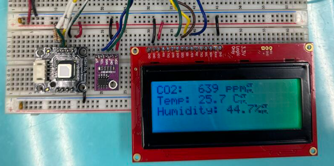

# AK9723AJ Tuning System

---

## Overview

This repository documents a four-lab series building a complete real-time tuning and display system for the **AK9723AJ CO₂ infrared sensor** using an **AVR128DB48 Curiosity Nano** board. The project progresses from bare-metal I²C driver primitives all the way to a multi-command finite state machine (FSM) that lets a user configure sensor registers from a terminal and toggle a live SerLCD display — all interrupt-driven, with zero RTOS dependency.

---

## Hardware

| Component | Part / Pin |
|---|---|
| Microcontroller | AVR128DB48 Curiosity Nano |
| CO₂ Sensor | AK9723AJ (I²C address `0x65`) |
| Display | SparkFun 4×20 SerLCD |
| I²C bus | TWI0 — PA2 (SDA), PA3 (SCL) |
| SerLCD TX | USART2 ALT1 — PF4 |
| Terminal RX | USART3 — PB3 (RX), PB2 (TX) |
| Data-ready | PA4 / INTN (active low) |
| Overcurrent LED | PA7 (active low) |

All labs share the same schematic: the AK9723AJ's FVDD/AVDD/SCL/SDA lines are pulled to +3.3 V via 3.3 kΩ resistors, and its PDN/INTN lines are wired to the MCU GPIOs listed above.

---

## Repository Structure

```
ak9723aj-tuning-system/
│
├── lab08/          # Lab 08 — Tuning System I: I²C Driver Primitives
│   └── src/
│       ├── ak9723aj_twi.c          # Basic TWI init + single register read
│       ├── ak9723aj_byte_read.c    # Byte-read helper; scans all registers
│       └── ak9723aj_ctrl_read.c    # Reads CNTL1–CNTL10 into a struct
│
├── lab09/          # Lab 09 — Tuning System II: Write & Block Read
│   └── src/
│       ├── ak9723aj_byte_write.c   # Byte-write to control registers
│       ├── ak9723aj_block_read.c   # Burst-read all 11 measurement registers
│       └── ak9723aj_meas_all_readings.c  # Full acquire loop with INTN polling
│
├── lab10/          # Lab 10 — Tuning System III: Live Display
│   └── src/
│       └── main.c                  # ADC conversion + USART2 ring-buffer display
│
└── lab12/          # Lab 12 — Tuning System IV: FSM Command Parser
    ├── task1/
    │   └── fsm_parser.c            # Switch-case FSM; USART3 interrupt-driven
    ├── task2/
    │   ├── ak9723.h / task2_ak9723.c   # Sensor driver module
    │   ├── fsm.h   / task2fsm.c        # Table-driven FSM; writes registers via I²C
    │   ├── task2usart3.c               # USART3 RX ISR
    │   └── task2main.c                 # Integration: sensor + display + FSM
    └── task3/
        ├── ak9723.h / task3_ak9723.c   # Sensor driver module
        ├── fsm.h   / task3fsm.c        # Extended FSM with P<CR> page-toggle
        ├── serlcd.h / task3serlcd.c    # Dual-page SerLCD driver
        ├── task3usart3.c               # USART3 RX ISR
        └── task3main.c                 # Full system integration
```

---

## Lab Progression

### Lab 08 — I²C Driver Primitives

Implements the six TWI master primitives from scratch:

```
TWI0_AK9723_init()     →  configure baud, enable master, set bus IDLE
TWI0_send_start()      →  issue START + 7-bit address + R/W bit
TWI0_write_byte()      →  transmit one byte, poll WIF
TWI0_read_byte()       →  receive one byte, send ACK or NACK
TWI0_send_stop()       →  release bus
TWI0_AK9723_byte_read()→  compose a full read transaction
```

Three programs are provided:
- **`ak9723aj_twi.c`** — proof-of-concept: reads register `0x00` once
- **`ak9723aj_byte_read.c`** — continuous scan of registers `0x00–0x18`
- **`ak9723aj_ctrl_read.c`** — reads `CNTL1–CNTL10` (`0x0F–0x18`) into a packed struct

**Key concept:** the repeated-START sequence (`write addr → write reg → START → read`) required by the AK9723AJ for register reads.

---

### Lab 09 — Write Operations & Block Read

Adds write capability and efficient burst reading:

- **`ak9723aj_byte_write.c`** — writes `0x67` to every control register in a loop, demonstrating `TWI0_AK9723_byte_write()`
- **`ak9723aj_block_read.c`** — burst-reads all 11 measurement registers (ST1 + IR1 + IR2 + TEMP + VF) into a `data_read` struct in a single I²C transaction
- **`ak9723aj_meas_all_readings.c`** — complete acquisition loop: configure → trigger (`0x14 = 0x02`) → poll `INTN` (PA4) → block read → repeat

---

### Lab 10 — Live Millivolt Display

Brings up the SparkFun SerLCD and proves the ADC bit-width experimentally.

**ADC Conversion:**

| Channel | Raw width | Scaling formula |
|---|---|---|
| IR1 / IR2 | 24-bit signed two's complement | `mV = raw × 7500 / 8388607` (range ±750.0 mV) |
| VF | 16-bit signed | `mV = raw × 15000 / 32767 + 14000` (range ±1500.0 mV + 1400 mV offset) |

**Display pipeline:**
1. `convert_store_vals()` — assembles raw bytes, sign-extends, scales with `int64_t` arithmetic, and formats into four 20-char buffers using `sprintf`
2. `USART_send_string()` — copies buffers into an 80-byte ring buffer and fires the USART2 DRE interrupt
3. `ISR(USART2_DRE_vect)` — drains the ring buffer one byte per interrupt, self-disables when empty

The overcurrent flag (bit 2 of ST1) drives PA7 low (LED on) on detection.

---

### Lab 12 — FSM Command Parser

Adds a terminal command interface so sensor registers can be updated in real time without reflashing.

#### Command format

```
Cn=hh<CR>      Set control register n (1–9) to hex value hh
P<CR>          Toggle display between Page 0 and Page 1
```

Examples: `C3=F0<Enter>` sets CNTL3 to 0xF0. `P<Enter>` flips the display.

#### Task 1 — Switch-Case FSM

A straightforward six-state machine implemented with a `switch` statement. Good for understanding the logic before abstracting it.

```
IDLE → [C/c] → STATE_C → [1-9] → STATE_REG → [=] → STATE_EQUAL
     → [hex] → STATE_VAL1 → [hex] → STATE_VAL2 → [CR] → execute_command()
```

All invalid transitions return to `IDLE`. The ISR feeds one character at a time to `fsm_parse()`.

#### Task 2 — Table-Driven FSM

Refactors the FSM into a 2D transition table `next_state[state][char_class]`. Side-effects (storing `reg_num`, assembling `value` nibble by nibble, calling `execute_command()`) happen before the table lookup so the current character is still available.

```c
// Character classification → table lookup → side-effect → transition
char_class_t cc = classify(c);
if (current_state == STATE_EQUAL && cc == CC_HEX) value = hex_to_val(c) << 4;
current_state = next_state[current_state][cc];
```

`execute_command()` computes `reg_addr = 0x0F + (reg - 1)` and calls `TWI0_AK9723_byte_write()` to push the value to the sensor, then updates the `cntl_regs[]` shadow array.

#### Task 3 — Dual-Page Display

Extends Task 2 with `STATE_P` and a `pg_num` flag:

- `P<CR>` → `toggle_page()` → `pg_num ^= 1`
- Main loop: if `pg_num == 0` call `USART_send_string()`, else call `USART_send_settings()`
- `USART_send_settings()` builds Page 1 from `cntl_regs[]` on the fly:

```
Line 1: C1=hh C2=hh C3=hh
Line 2: C4=hh C5=hh C6=hh
Line 3: C7=hh C8=hh C9=hh
```

---

## Building

These projects target the **AVR128DB48** and are intended for **Microchip Studio** (formerly Atmel Studio) or **avr-gcc** with the AVR-LibC toolchain.

```bash
# Compile a single file (example)
avr-gcc -mmcu=avr128db48 -DF_CPU=4000000UL -O2 -o main.elf lab10/src/main.c

# Or use Microchip Studio: File → New Project → GCC C Executable Project
# Target device: AVR128DB48
# Add source files from the relevant lab folder
```

Flash with **MPLAB IPE**, **avrdude**, or the Curiosity Nano's on-board PKOB4 debugger.

---

## Configuration Notes

| Setting | Value |
|---|---|
| CPU clock | 4 MHz (internal oscillator) |
| TWI baud register | `MBAUD = 2` (~400 kHz I²C) |
| USART2 baud register | `1667` → 9600 baud @ 4 MHz |
| USART3 baud register | `1667` → 9600 baud @ 4 MHz |
| USART2 pin mux | `PORTMUX_USART2_ALT1_gc` (PF4/PF5) |

---

## Authors

**Faid Faisal** · Student ID 115810240
**Melchai Mathew** · Student ID 115448201

Section 01 — Bench 04
ESE 476, Stony Brook University — Spring 2026
